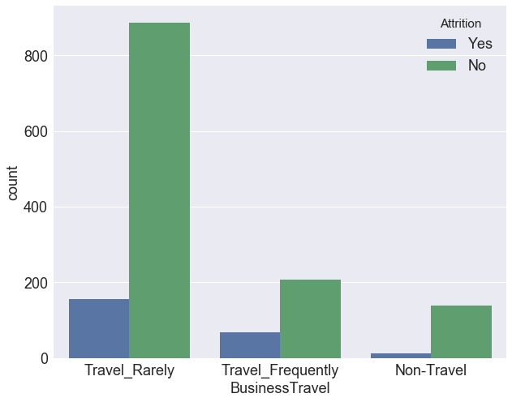

# Краткий вводный обзор Python-библиотек для data science

### Сафин Руслан, технический директор Byndyusoft™ 
<br/>

  @razonrus

<br/>
<br/>
<br/>
<br/>
<br/>
<br/>
<br/>
<br/>
<br/>
<br/>
<br/>
<br/>
<br/>
<br/>
<br/>

# Для кого этот доклад?
<br/>
<br/>
<br/>
<br/>
<br/>
<br/>
<br/>
<br/>
<br/>
<br/>
<br/>
<br/>

# Анализ данных
## Pandas


```python
import pandas as pd
```

## IBM HR Analytics Employee Attrition & Performance
### Predict attrition of your valuable employees
https://www.kaggle.com/pavansubhasht/ibm-hr-analytics-attrition-dataset


```python
df = pd.read_csv('data/WA_Fn-UseC_-HR-Employee-Attrition.csv')
```


```python
df.head()
```


<div>
<table border="1" class="dataframe">
  <thead>
    <tr style="text-align: right;">
      <th></th>
      <th>Age</th>
      <th>Attrition</th>
      <th>BusinessTravel</th>
      <th>DailyRate</th>
      <th>Department</th>
      <th>DistanceFromHome</th>
      <th>Education</th>
      <th>EducationField</th>
      <th>EmployeeCount</th>
      <th>EmployeeNumber</th>
      <th>...</th>
      <th>RelationshipSatisfaction</th>
      <th>StandardHours</th>
      <th>StockOptionLevel</th>
      <th>TotalWorkingYears</th>
      <th>TrainingTimesLastYear</th>
      <th>WorkLifeBalance</th>
      <th>YearsAtCompany</th>
      <th>YearsInCurrentRole</th>
      <th>YearsSinceLastPromotion</th>
      <th>YearsWithCurrManager</th>
    </tr>
  </thead>
  <tbody>
    <tr>
      <th>0</th>
      <td>41</td>
      <td>Yes</td>
      <td>Travel_Rarely</td>
      <td>1102</td>
      <td>Sales</td>
      <td>1</td>
      <td>2</td>
      <td>Life Sciences</td>
      <td>1</td>
      <td>1</td>
      <td>...</td>
      <td>1</td>
      <td>80</td>
      <td>0</td>
      <td>8</td>
      <td>0</td>
      <td>1</td>
      <td>6</td>
      <td>4</td>
      <td>0</td>
      <td>5</td>
    </tr>
    <tr>
      <th>1</th>
      <td>49</td>
      <td>No</td>
      <td>Travel_Frequently</td>
      <td>279</td>
      <td>Research &amp; Development</td>
      <td>8</td>
      <td>1</td>
      <td>Life Sciences</td>
      <td>1</td>
      <td>2</td>
      <td>...</td>
      <td>4</td>
      <td>80</td>
      <td>1</td>
      <td>10</td>
      <td>3</td>
      <td>3</td>
      <td>10</td>
      <td>7</td>
      <td>1</td>
      <td>7</td>
    </tr>
    <tr>
      <th>2</th>
      <td>37</td>
      <td>Yes</td>
      <td>Travel_Rarely</td>
      <td>1373</td>
      <td>Research &amp; Development</td>
      <td>2</td>
      <td>2</td>
      <td>Other</td>
      <td>1</td>
      <td>4</td>
      <td>...</td>
      <td>2</td>
      <td>80</td>
      <td>0</td>
      <td>7</td>
      <td>3</td>
      <td>3</td>
      <td>0</td>
      <td>0</td>
      <td>0</td>
      <td>0</td>
    </tr>
    <tr>
      <th>3</th>
      <td>33</td>
      <td>No</td>
      <td>Travel_Frequently</td>
      <td>1392</td>
      <td>Research &amp; Development</td>
      <td>3</td>
      <td>4</td>
      <td>Life Sciences</td>
      <td>1</td>
      <td>5</td>
      <td>...</td>
      <td>3</td>
      <td>80</td>
      <td>0</td>
      <td>8</td>
      <td>3</td>
      <td>3</td>
      <td>8</td>
      <td>7</td>
      <td>3</td>
      <td>0</td>
    </tr>
    <tr>
      <th>4</th>
      <td>27</td>
      <td>No</td>
      <td>Travel_Rarely</td>
      <td>591</td>
      <td>Research &amp; Development</td>
      <td>2</td>
      <td>1</td>
      <td>Medical</td>
      <td>1</td>
      <td>7</td>
      <td>...</td>
      <td>4</td>
      <td>80</td>
      <td>1</td>
      <td>6</td>
      <td>3</td>
      <td>3</td>
      <td>2</td>
      <td>2</td>
      <td>2</td>
      <td>2</td>
    </tr>
  </tbody>
</table>
<p>5 rows × 35 columns</p>
</div>


```python
df.columns
```


    Index([u'Age', u'Attrition', u'BusinessTravel', u'DailyRate', u'Department',
           u'DistanceFromHome', u'Education', u'EducationField', u'EmployeeCount',
           u'EmployeeNumber', u'EnvironmentSatisfaction', u'Gender', u'HourlyRate',
           u'JobInvolvement', u'JobLevel', u'JobRole', u'JobSatisfaction',
           u'MaritalStatus', u'MonthlyIncome', u'MonthlyRate',
           u'NumCompaniesWorked', u'Over18', u'OverTime', u'PercentSalaryHike',
           u'PerformanceRating', u'RelationshipSatisfaction', u'StandardHours',
           u'StockOptionLevel', u'TotalWorkingYears', u'TrainingTimesLastYear',
           u'WorkLifeBalance', u'YearsAtCompany', u'YearsInCurrentRole',
           u'YearsSinceLastPromotion', u'YearsWithCurrManager'],
          dtype='object')


```python
df.shape
```


    (1470, 35)


```python
df.info()
```

    <class 'pandas.core.frame.DataFrame'>
    RangeIndex: 1470 entries, 0 to 1469
    Data columns (total 35 columns):
    Age                         1470 non-null int64
    Attrition                   1470 non-null object
    BusinessTravel              1470 non-null object
    DailyRate                   1470 non-null int64
    Department                  1470 non-null object
    DistanceFromHome            1470 non-null int64
    Education                   1470 non-null int64
    EducationField              1470 non-null object
    EmployeeCount               1470 non-null int64
    EmployeeNumber              1470 non-null int64
    EnvironmentSatisfaction     1470 non-null int64
    Gender                      1470 non-null object
    HourlyRate                  1470 non-null int64
    JobInvolvement              1470 non-null int64
    JobLevel                    1470 non-null int64
    JobRole                     1470 non-null object
    JobSatisfaction             1470 non-null int64
    MaritalStatus               1470 non-null object
    MonthlyIncome               1470 non-null int64
    MonthlyRate                 1470 non-null int64
    NumCompaniesWorked          1470 non-null int64
    Over18                      1470 non-null object
    OverTime                    1470 non-null object
    PercentSalaryHike           1470 non-null int64
    PerformanceRating           1470 non-null int64
    RelationshipSatisfaction    1470 non-null int64
    StandardHours               1470 non-null int64
    StockOptionLevel            1470 non-null int64
    TotalWorkingYears           1470 non-null int64
    TrainingTimesLastYear       1470 non-null int64
    WorkLifeBalance             1470 non-null int64
    YearsAtCompany              1470 non-null int64
    YearsInCurrentRole          1470 non-null int64
    YearsSinceLastPromotion     1470 non-null int64
    YearsWithCurrManager        1470 non-null int64
    dtypes: int64(26), object(9)
    memory usage: 402.0+ KB
    


```python
df.describe()
```


<div>
<style>
    .dataframe thead tr:only-child th {
        text-align: right;
    }

    .dataframe thead th {
        text-align: left;
    }

    .dataframe tbody tr th {
        vertical-align: top;
    }
</style>
<table border="1" class="dataframe">
  <thead>
    <tr style="text-align: right;">
      <th></th>
      <th>Age</th>
      <th>DailyRate</th>
      <th>DistanceFromHome</th>
      <th>Education</th>
      <th>EmployeeCount</th>
      <th>EmployeeNumber</th>
      <th>EnvironmentSatisfaction</th>
      <th>HourlyRate</th>
      <th>JobInvolvement</th>
      <th>JobLevel</th>
      <th>...</th>
      <th>RelationshipSatisfaction</th>
      <th>StandardHours</th>
      <th>StockOptionLevel</th>
      <th>TotalWorkingYears</th>
      <th>TrainingTimesLastYear</th>
      <th>WorkLifeBalance</th>
      <th>YearsAtCompany</th>
      <th>YearsInCurrentRole</th>
      <th>YearsSinceLastPromotion</th>
      <th>YearsWithCurrManager</th>
    </tr>
  </thead>
  <tbody>
    <tr>
      <th>count</th>
      <td>1470.000000</td>
      <td>1470.000000</td>
      <td>1470.000000</td>
      <td>1470.000000</td>
      <td>1470.0</td>
      <td>1470.000000</td>
      <td>1470.000000</td>
      <td>1470.000000</td>
      <td>1470.000000</td>
      <td>1470.000000</td>
      <td>...</td>
      <td>1470.000000</td>
      <td>1470.0</td>
      <td>1470.000000</td>
      <td>1470.000000</td>
      <td>1470.000000</td>
      <td>1470.000000</td>
      <td>1470.000000</td>
      <td>1470.000000</td>
      <td>1470.000000</td>
      <td>1470.000000</td>
    </tr>
    <tr>
      <th>mean</th>
      <td>36.923810</td>
      <td>802.485714</td>
      <td>9.192517</td>
      <td>2.912925</td>
      <td>1.0</td>
      <td>1024.865306</td>
      <td>2.721769</td>
      <td>65.891156</td>
      <td>2.729932</td>
      <td>2.063946</td>
      <td>...</td>
      <td>2.712245</td>
      <td>80.0</td>
      <td>0.793878</td>
      <td>11.279592</td>
      <td>2.799320</td>
      <td>2.761224</td>
      <td>7.008163</td>
      <td>4.229252</td>
      <td>2.187755</td>
      <td>4.123129</td>
    </tr>
    <tr>
      <th>std</th>
      <td>9.135373</td>
      <td>403.509100</td>
      <td>8.106864</td>
      <td>1.024165</td>
      <td>0.0</td>
      <td>602.024335</td>
      <td>1.093082</td>
      <td>20.329428</td>
      <td>0.711561</td>
      <td>1.106940</td>
      <td>...</td>
      <td>1.081209</td>
      <td>0.0</td>
      <td>0.852077</td>
      <td>7.780782</td>
      <td>1.289271</td>
      <td>0.706476</td>
      <td>6.126525</td>
      <td>3.623137</td>
      <td>3.222430</td>
      <td>3.568136</td>
    </tr>
    <tr>
      <th>min</th>
      <td>18.000000</td>
      <td>102.000000</td>
      <td>1.000000</td>
      <td>1.000000</td>
      <td>1.0</td>
      <td>1.000000</td>
      <td>1.000000</td>
      <td>30.000000</td>
      <td>1.000000</td>
      <td>1.000000</td>
      <td>...</td>
      <td>1.000000</td>
      <td>80.0</td>
      <td>0.000000</td>
      <td>0.000000</td>
      <td>0.000000</td>
      <td>1.000000</td>
      <td>0.000000</td>
      <td>0.000000</td>
      <td>0.000000</td>
      <td>0.000000</td>
    </tr>
    <tr>
      <th>25%</th>
      <td>30.000000</td>
      <td>465.000000</td>
      <td>2.000000</td>
      <td>2.000000</td>
      <td>1.0</td>
      <td>491.250000</td>
      <td>2.000000</td>
      <td>48.000000</td>
      <td>2.000000</td>
      <td>1.000000</td>
      <td>...</td>
      <td>2.000000</td>
      <td>80.0</td>
      <td>0.000000</td>
      <td>6.000000</td>
      <td>2.000000</td>
      <td>2.000000</td>
      <td>3.000000</td>
      <td>2.000000</td>
      <td>0.000000</td>
      <td>2.000000</td>
    </tr>
    <tr>
      <th>50%</th>
      <td>36.000000</td>
      <td>802.000000</td>
      <td>7.000000</td>
      <td>3.000000</td>
      <td>1.0</td>
      <td>1020.500000</td>
      <td>3.000000</td>
      <td>66.000000</td>
      <td>3.000000</td>
      <td>2.000000</td>
      <td>...</td>
      <td>3.000000</td>
      <td>80.0</td>
      <td>1.000000</td>
      <td>10.000000</td>
      <td>3.000000</td>
      <td>3.000000</td>
      <td>5.000000</td>
      <td>3.000000</td>
      <td>1.000000</td>
      <td>3.000000</td>
    </tr>
    <tr>
      <th>75%</th>
      <td>43.000000</td>
      <td>1157.000000</td>
      <td>14.000000</td>
      <td>4.000000</td>
      <td>1.0</td>
      <td>1555.750000</td>
      <td>4.000000</td>
      <td>83.750000</td>
      <td>3.000000</td>
      <td>3.000000</td>
      <td>...</td>
      <td>4.000000</td>
      <td>80.0</td>
      <td>1.000000</td>
      <td>15.000000</td>
      <td>3.000000</td>
      <td>3.000000</td>
      <td>9.000000</td>
      <td>7.000000</td>
      <td>3.000000</td>
      <td>7.000000</td>
    </tr>
    <tr>
      <th>max</th>
      <td>60.000000</td>
      <td>1499.000000</td>
      <td>29.000000</td>
      <td>5.000000</td>
      <td>1.0</td>
      <td>2068.000000</td>
      <td>4.000000</td>
      <td>100.000000</td>
      <td>4.000000</td>
      <td>5.000000</td>
      <td>...</td>
      <td>4.000000</td>
      <td>80.0</td>
      <td>3.000000</td>
      <td>40.000000</td>
      <td>6.000000</td>
      <td>4.000000</td>
      <td>40.000000</td>
      <td>18.000000</td>
      <td>15.000000</td>
      <td>17.000000</td>
    </tr>
  </tbody>
</table>
<p>8 rows × 26 columns</p>
</div>


```python
#s = df.describe().loc['std']
```


```python
#s[s == 0]
```


```python
df.describe(include=['object', 'bool'])
```


<div>
<style>
    .dataframe thead tr:only-child th {
        text-align: right;
    }

    .dataframe thead th {
        text-align: left;
    }

    .dataframe tbody tr th {
        vertical-align: top;
    }
</style>
<table border="1" class="dataframe">
  <thead>
    <tr style="text-align: right;">
      <th></th>
      <th>Attrition</th>
      <th>BusinessTravel</th>
      <th>Department</th>
      <th>EducationField</th>
      <th>Gender</th>
      <th>JobRole</th>
      <th>MaritalStatus</th>
      <th>Over18</th>
      <th>OverTime</th>
    </tr>
  </thead>
  <tbody>
    <tr>
      <th>count</th>
      <td>1470</td>
      <td>1470</td>
      <td>1470</td>
      <td>1470</td>
      <td>1470</td>
      <td>1470</td>
      <td>1470</td>
      <td>1470</td>
      <td>1470</td>
    </tr>
    <tr>
      <th>unique</th>
      <td>2</td>
      <td>3</td>
      <td>3</td>
      <td>6</td>
      <td>2</td>
      <td>9</td>
      <td>3</td>
      <td>1</td>
      <td>2</td>
    </tr>
    <tr>
      <th>top</th>
      <td>No</td>
      <td>Travel_Rarely</td>
      <td>Research &amp; Development</td>
      <td>Life Sciences</td>
      <td>Male</td>
      <td>Sales Executive</td>
      <td>Married</td>
      <td>Y</td>
      <td>No</td>
    </tr>
    <tr>
      <th>freq</th>
      <td>1233</td>
      <td>1043</td>
      <td>961</td>
      <td>606</td>
      <td>882</td>
      <td>326</td>
      <td>673</td>
      <td>1470</td>
      <td>1054</td>
    </tr>
  </tbody>
</table>
</div>


```python
df = df.drop(['Over18', 'EmployeeCount', 'StandardHours'], axis=1)
```


```python
df.shape
```


    (1470, 32)


```python
df['Attrition'].value_counts()
```


    No     1233
    Yes     237
    Name: Attrition, dtype: int64


```python
df['JobRole'].value_counts()
```


    Sales Executive              326
    Research Scientist           292
    Laboratory Technician        259
    Manufacturing Director       145
    Healthcare Representative    131
    Manager                      102
    Sales Representative          83
    Research Director             80
    Human Resources               52
    Name: JobRole, dtype: int64


```python
df['JobRole'].value_counts(normalize=True)
```


    Sales Executive              0.221769
    Research Scientist           0.198639
    Laboratory Technician        0.176190
    Manufacturing Director       0.098639
    Healthcare Representative    0.089116
    Manager                      0.069388
    Sales Representative         0.056463
    Research Director            0.054422
    Human Resources              0.035374
    Name: JobRole, dtype: float64


```python
df[df['Attrition'] == 'Yes'].mean()
```


    Age                            33.607595
    DailyRate                     750.362869
    DistanceFromHome               10.632911
    Education                       2.839662
    EmployeeNumber               1010.345992
    EnvironmentSatisfaction         2.464135
    HourlyRate                     65.573840
    JobInvolvement                  2.518987
    JobLevel                        1.637131
    JobSatisfaction                 2.468354
    MonthlyIncome                4787.092827
    MonthlyRate                 14559.308017
    NumCompaniesWorked              2.940928
    PercentSalaryHike              15.097046
    PerformanceRating               3.156118
    RelationshipSatisfaction        2.599156
    StockOptionLevel                0.527426
    TotalWorkingYears               8.244726
    TrainingTimesLastYear           2.624473
    WorkLifeBalance                 2.658228
    YearsAtCompany                  5.130802
    YearsInCurrentRole              2.902954
    YearsSinceLastPromotion         1.945148
    YearsWithCurrManager            2.852321
    dtype: float64


```python
df[df['Attrition'] == 'Yes']['YearsWithCurrManager'].mean()
```


    2.852320675105485


```python
df[df['Attrition'] == 'No']['YearsWithCurrManager'].mean()
```


    4.367396593673966


```python
df[(df['MaritalStatus'] != 'Married') & (df['BusinessTravel'] == 'Travel_Frequently')]['Attrition'].value_counts(normalize=True)
```


    No     0.685535
    Yes    0.314465
    Name: Attrition, dtype: float64


```python
df['Attrition'].value_counts(normalize=True)
```


    No     0.838776
    Yes    0.161224
    Name: Attrition, dtype: float64


### Группировка


```python
df.groupby(['Attrition'])[['DistanceFromHome','YearsWithCurrManager']].describe(percentiles=[])
```


<div>
<style>
    .dataframe thead tr:only-child th {
        text-align: right;
    }

    .dataframe thead th {
        text-align: left;
    }

    .dataframe tbody tr th {
        vertical-align: top;
    }
</style>
<table border="1" class="dataframe">
  <thead>
    <tr>
      <th></th>
      <th colspan="6" halign="left">DistanceFromHome</th>
      <th colspan="6" halign="left">YearsWithCurrManager</th>
    </tr>
    <tr>
      <th></th>
      <th>count</th>
      <th>mean</th>
      <th>std</th>
      <th>min</th>
      <th>50%</th>
      <th>max</th>
      <th>count</th>
      <th>mean</th>
      <th>std</th>
      <th>min</th>
      <th>50%</th>
      <th>max</th>
    </tr>
    <tr>
      <th>Attrition</th>
      <th></th>
      <th></th>
      <th></th>
      <th></th>
      <th></th>
      <th></th>
      <th></th>
      <th></th>
      <th></th>
      <th></th>
      <th></th>
      <th></th>
    </tr>
  </thead>
  <tbody>
    <tr>
      <th>No</th>
      <td>1233.0</td>
      <td>8.915653</td>
      <td>8.012633</td>
      <td>1.0</td>
      <td>7.0</td>
      <td>29.0</td>
      <td>1233.0</td>
      <td>4.367397</td>
      <td>3.594116</td>
      <td>0.0</td>
      <td>3.0</td>
      <td>17.0</td>
    </tr>
    <tr>
      <th>Yes</th>
      <td>237.0</td>
      <td>10.632911</td>
      <td>8.452525</td>
      <td>1.0</td>
      <td>9.0</td>
      <td>29.0</td>
      <td>237.0</td>
      <td>2.852321</td>
      <td>3.143349</td>
      <td>0.0</td>
      <td>2.0</td>
      <td>14.0</td>
    </tr>
  </tbody>
</table>
</div>


### Сводные таблицы


```python
pd.crosstab(df['Attrition'], df['MaritalStatus'])
```


<div>
<style>
    .dataframe thead tr:only-child th {
        text-align: right;
    }

    .dataframe thead th {
        text-align: left;
    }

    .dataframe tbody tr th {
        vertical-align: top;
    }
</style>
<table border="1" class="dataframe">
  <thead>
    <tr style="text-align: right;">
      <th>MaritalStatus</th>
      <th>Divorced</th>
      <th>Married</th>
      <th>Single</th>
    </tr>
    <tr>
      <th>Attrition</th>
      <th></th>
      <th></th>
      <th></th>
    </tr>
  </thead>
  <tbody>
    <tr>
      <th>No</th>
      <td>294</td>
      <td>589</td>
      <td>350</td>
    </tr>
    <tr>
      <th>Yes</th>
      <td>33</td>
      <td>84</td>
      <td>120</td>
    </tr>
  </tbody>
</table>
</div>


```python
pd.crosstab(df['Attrition'], df['MaritalStatus'], normalize=True)
```


<div>
<style>
    .dataframe thead tr:only-child th {
        text-align: right;
    }

    .dataframe thead th {
        text-align: left;
    }

    .dataframe tbody tr th {
        vertical-align: top;
    }
</style>
<table border="1" class="dataframe">
  <thead>
    <tr style="text-align: right;">
      <th>MaritalStatus</th>
      <th>Divorced</th>
      <th>Married</th>
      <th>Single</th>
    </tr>
    <tr>
      <th>Attrition</th>
      <th></th>
      <th></th>
      <th></th>
    </tr>
  </thead>
  <tbody>
    <tr>
      <th>No</th>
      <td>0.200000</td>
      <td>0.400680</td>
      <td>0.238095</td>
    </tr>
    <tr>
      <th>Yes</th>
      <td>0.022449</td>
      <td>0.057143</td>
      <td>0.081633</td>
    </tr>
  </tbody>
</table>
</div>


```python
df.pivot_table(['DailyRate','Education','TotalWorkingYears'], 
['Department'], aggfunc='mean')
```


<div>
<style>
    .dataframe thead tr:only-child th {
        text-align: right;
    }

    .dataframe thead th {
        text-align: left;
    }

    .dataframe tbody tr th {
        vertical-align: top;
    }
</style>
<table border="1" class="dataframe">
  <thead>
    <tr style="text-align: right;">
      <th></th>
      <th>DailyRate</th>
      <th>Education</th>
      <th>TotalWorkingYears</th>
    </tr>
    <tr>
      <th>Department</th>
      <th></th>
      <th></th>
      <th></th>
    </tr>
  </thead>
  <tbody>
    <tr>
      <th>Human Resources</th>
      <td>751.539683</td>
      <td>2.968254</td>
      <td>11.555556</td>
    </tr>
    <tr>
      <th>Research &amp; Development</th>
      <td>806.851197</td>
      <td>2.899063</td>
      <td>11.342352</td>
    </tr>
    <tr>
      <th>Sales</th>
      <td>800.275785</td>
      <td>2.934978</td>
      <td>11.105381</td>
    </tr>
  </tbody>
</table>
</div>


```python
pd.crosstab(df['Attrition'], df['BusinessTravel'], margins=True)
```


<div>
<style>
    .dataframe thead tr:only-child th {
        text-align: right;
    }

    .dataframe thead th {
        text-align: left;
    }

    .dataframe tbody tr th {
        vertical-align: top;
    }
</style>
<table border="1" class="dataframe">
  <thead>
    <tr style="text-align: right;">
      <th>BusinessTravel</th>
      <th>Non-Travel</th>
      <th>Travel_Frequently</th>
      <th>Travel_Rarely</th>
      <th>All</th>
    </tr>
    <tr>
      <th>Attrition</th>
      <th></th>
      <th></th>
      <th></th>
      <th></th>
    </tr>
  </thead>
  <tbody>
    <tr>
      <th>No</th>
      <td>138</td>
      <td>208</td>
      <td>887</td>
      <td>1233</td>
    </tr>
    <tr>
      <th>Yes</th>
      <td>12</td>
      <td>69</td>
      <td>156</td>
      <td>237</td>
    </tr>
    <tr>
      <th>All</th>
      <td>150</td>
      <td>277</td>
      <td>1043</td>
      <td>1470</td>
    </tr>
  </tbody>
</table>
</div>


# Визуализация данных
## Seaborn и Matplotlib


```python
%matplotlib inline
import seaborn as sns
import matplotlib.pyplot as plt
#графики в svg выглядят более четкими
#%config InlineBackend.figure_format = 'svg' 

#увеличим дефолтный размер графиков
from pylab import rcParams
rcParams['figure.figsize'] = 10, 8;
```


```python
BIGGER_SIZE = 18

plt.rc('font', size=BIGGER_SIZE)          # controls default text sizes
plt.rc('axes', titlesize=BIGGER_SIZE)     # fontsize of the axes title
plt.rc('axes', labelsize=BIGGER_SIZE)    # fontsize of the x and y labels
plt.rc('xtick', labelsize=BIGGER_SIZE)    # fontsize of the tick labels
plt.rc('ytick', labelsize=BIGGER_SIZE)    # fontsize of the tick labels
plt.rc('legend', fontsize=BIGGER_SIZE)    # legend fontsize
plt.rc('figure', titlesize=BIGGER_SIZE)  # fontsize of the figure title
```


```python
df['Attrition'].value_counts().plot(kind='bar', label='Attrition')
plt.legend()
plt.title('Attrition distribution');
```


```python
pd.crosstab(df['Attrition'], df['BusinessTravel'], margins=True)
```


<div>
<style>
    .dataframe thead tr:only-child th {
        text-align: right;
    }

    .dataframe thead th {
        text-align: left;
    }

    .dataframe tbody tr th {
        vertical-align: top;
    }
</style>
<table border="1" class="dataframe">
  <thead>
    <tr style="text-align: right;">
      <th>BusinessTravel</th>
      <th>Non-Travel</th>
      <th>Travel_Frequently</th>
      <th>Travel_Rarely</th>
      <th>All</th>
    </tr>
    <tr>
      <th>Attrition</th>
      <th></th>
      <th></th>
      <th></th>
      <th></th>
    </tr>
  </thead>
  <tbody>
    <tr>
      <th>No</th>
      <td>138</td>
      <td>208</td>
      <td>887</td>
      <td>1233</td>
    </tr>
    <tr>
      <th>Yes</th>
      <td>12</td>
      <td>69</td>
      <td>156</td>
      <td>237</td>
    </tr>
    <tr>
      <th>All</th>
      <td>150</td>
      <td>277</td>
      <td>1043</td>
      <td>1470</td>
    </tr>
  </tbody>
</table>
</div>


```python
sns.countplot(x='BusinessTravel', hue='Attrition', data=df);
```





```python
sns.countplot(x='MaritalStatus', hue='Attrition', data=df);
```


```python
pd.crosstab(df['Attrition'], df['StockOptionLevel'], margins=True)
```


<div>
<style>
    .dataframe thead tr:only-child th {
        text-align: right;
    }

    .dataframe thead th {
        text-align: left;
    }

    .dataframe tbody tr th {
        vertical-align: top;
    }
</style>
<table border="1" class="dataframe">
  <thead>
    <tr style="text-align: right;">
      <th>StockOptionLevel</th>
      <th>0</th>
      <th>1</th>
      <th>2</th>
      <th>3</th>
      <th>All</th>
    </tr>
    <tr>
      <th>Attrition</th>
      <th></th>
      <th></th>
      <th></th>
      <th></th>
      <th></th>
    </tr>
  </thead>
  <tbody>
    <tr>
      <th>No</th>
      <td>477</td>
      <td>540</td>
      <td>146</td>
      <td>70</td>
      <td>1233</td>
    </tr>
    <tr>
      <th>Yes</th>
      <td>154</td>
      <td>56</td>
      <td>12</td>
      <td>15</td>
      <td>237</td>
    </tr>
    <tr>
      <th>All</th>
      <td>631</td>
      <td>596</td>
      <td>158</td>
      <td>85</td>
      <td>1470</td>
    </tr>
  </tbody>
</table>
</div>


```python
sns.countplot(x='StockOptionLevel', hue='Attrition', data=df);
```


```python
#df['Risk'] = ((df['MaritalStatus'] != 'Married') & (df['BusinessTravel'] == 'Travel_Frequently') &(df['StockOptionLevel'] == 0)).astype('int')
```


```python
#df[['Risk','MaritalStatus','BusinessTravel', 'StockOptionLevel']].head(6)
```


```python
#pd.crosstab(df['Attrition'], df['Risk'])
```


```python
#sns.countplot(x='Risk', hue='Attrition', data=df);
```

### Scatter plot matrix


```python
cols = ['DailyRate','Age','TotalWorkingYears']
sns_plot = sns.pairplot(df[cols], size = 4)
sns_plot.savefig('pairplot.png')
```


### Гистограмма и KDE (<a href="https://en.wikipedia.org/wiki/Kernel_density_estimation"> kernel density estimation</a>)


```python
sns.distplot(df.Age)
```


    <matplotlib.axes._subplots.AxesSubplot at 0x10f61c88>


```python
sns.jointplot(df.YearsAtCompany, df.MonthlyIncome, size =10)
```


    <seaborn.axisgrid.JointGrid at 0xfd3f2b0>


### Box plot


```python
sns.boxplot(y="Department", x="YearsAtCompany", data=df, orient="h")
```


    <matplotlib.axes._subplots.AxesSubplot at 0x1117af60>


Box plot состоит из коробки (поэтому он и называется box plot), усиков и точек. Коробка показывает интерквартильный размах распределения, то есть соответственно 25% (Q1) и 75% (Q3) перцентили. Черта внутри коробки обозначает медиану распределения.
С коробкой разобрались, перейдем к усам. Усы отображают весь разброс точек кроме выбросов, то есть минимальные и максимальные значения, которые попадают в промежуток (Q1 - 1.5\*IQR, Q3 + 1.5\*IQR), где IQR = Q3 - Q1 — интерквартильный размах. Точками на графике обозначаются выбросы (outliers) — те значения, которые не вписываются в промежуток значений, заданный усами графика.


### Heat map


```python
department_ef_mi = df.pivot_table(
                        index='Department', 
                        columns='EducationField', 
                        values='YearsInCurrentRole', 
                        aggfunc='mean').fillna(0).applymap(float)
sns.heatmap(department_ef_mi, annot=True, fmt=".1f", linewidths=.5)
```


    <matplotlib.axes._subplots.AxesSubplot at 0x11514b00>


```python
df['Attrition'] = (df['Attrition']=='Yes').astype('int64')
```


```python
corr_matrix = df.corr()
```


```python
corr_matrix.head()
```


<div>
<style>
    .dataframe thead tr:only-child th {
        text-align: right;
    }

    .dataframe thead th {
        text-align: left;
    }

    .dataframe tbody tr th {
        vertical-align: top;
    }
</style>
<table border="1" class="dataframe">
  <thead>
    <tr style="text-align: right;">
      <th></th>
      <th>Age</th>
      <th>Attrition</th>
      <th>DailyRate</th>
      <th>DistanceFromHome</th>
      <th>Education</th>
      <th>EmployeeNumber</th>
      <th>EnvironmentSatisfaction</th>
      <th>HourlyRate</th>
      <th>JobInvolvement</th>
      <th>JobLevel</th>
      <th>...</th>
      <th>PerformanceRating</th>
      <th>RelationshipSatisfaction</th>
      <th>StockOptionLevel</th>
      <th>TotalWorkingYears</th>
      <th>TrainingTimesLastYear</th>
      <th>WorkLifeBalance</th>
      <th>YearsAtCompany</th>
      <th>YearsInCurrentRole</th>
      <th>YearsSinceLastPromotion</th>
      <th>YearsWithCurrManager</th>
    </tr>
  </thead>
  <tbody>
    <tr>
      <th>Age</th>
      <td>1.000000</td>
      <td>-0.159205</td>
      <td>0.010661</td>
      <td>-0.001686</td>
      <td>0.208034</td>
      <td>-0.010145</td>
      <td>0.010146</td>
      <td>0.024287</td>
      <td>0.029820</td>
      <td>0.509604</td>
      <td>...</td>
      <td>0.001904</td>
      <td>0.053535</td>
      <td>0.037510</td>
      <td>0.680381</td>
      <td>-0.019621</td>
      <td>-0.021490</td>
      <td>0.311309</td>
      <td>0.212901</td>
      <td>0.216513</td>
      <td>0.202089</td>
    </tr>
    <tr>
      <th>Attrition</th>
      <td>-0.159205</td>
      <td>1.000000</td>
      <td>-0.056652</td>
      <td>0.077924</td>
      <td>-0.031373</td>
      <td>-0.010577</td>
      <td>-0.103369</td>
      <td>-0.006846</td>
      <td>-0.130016</td>
      <td>-0.169105</td>
      <td>...</td>
      <td>0.002889</td>
      <td>-0.045872</td>
      <td>-0.137145</td>
      <td>-0.171063</td>
      <td>-0.059478</td>
      <td>-0.063939</td>
      <td>-0.134392</td>
      <td>-0.160545</td>
      <td>-0.033019</td>
      <td>-0.156199</td>
    </tr>
    <tr>
      <th>DailyRate</th>
      <td>0.010661</td>
      <td>-0.056652</td>
      <td>1.000000</td>
      <td>-0.004985</td>
      <td>-0.016806</td>
      <td>-0.050990</td>
      <td>0.018355</td>
      <td>0.023381</td>
      <td>0.046135</td>
      <td>0.002966</td>
      <td>...</td>
      <td>0.000473</td>
      <td>0.007846</td>
      <td>0.042143</td>
      <td>0.014515</td>
      <td>0.002453</td>
      <td>-0.037848</td>
      <td>-0.034055</td>
      <td>0.009932</td>
      <td>-0.033229</td>
      <td>-0.026363</td>
    </tr>
    <tr>
      <th>DistanceFromHome</th>
      <td>-0.001686</td>
      <td>0.077924</td>
      <td>-0.004985</td>
      <td>1.000000</td>
      <td>0.021042</td>
      <td>0.032916</td>
      <td>-0.016075</td>
      <td>0.031131</td>
      <td>0.008783</td>
      <td>0.005303</td>
      <td>...</td>
      <td>0.027110</td>
      <td>0.006557</td>
      <td>0.044872</td>
      <td>0.004628</td>
      <td>-0.036942</td>
      <td>-0.026556</td>
      <td>0.009508</td>
      <td>0.018845</td>
      <td>0.010029</td>
      <td>0.014406</td>
    </tr>
    <tr>
      <th>Education</th>
      <td>0.208034</td>
      <td>-0.031373</td>
      <td>-0.016806</td>
      <td>0.021042</td>
      <td>1.000000</td>
      <td>0.042070</td>
      <td>-0.027128</td>
      <td>0.016775</td>
      <td>0.042438</td>
      <td>0.101589</td>
      <td>...</td>
      <td>-0.024539</td>
      <td>-0.009118</td>
      <td>0.018422</td>
      <td>0.148280</td>
      <td>-0.025100</td>
      <td>0.009819</td>
      <td>0.069114</td>
      <td>0.060236</td>
      <td>0.054254</td>
      <td>0.069065</td>
    </tr>
  </tbody>
</table>
<p>5 rows × 25 columns</p>
</div>


```python
sns.heatmap(corr_matrix);
```


```python
features = list(set(df.columns) - set(['BusinessTravel', 'Department',  'EducationField',
                                      'Gender',   'JobRole',   'MaritalStatus',
                                        'Over18', 'OverTime', 'Attrition']))
```


```python
df[features[:9]].hist(figsize=(20,16));
```


```python
sns.pairplot(df[['DistanceFromHome','YearsWithCurrManager','Attrition']], hue='Attrition', size = 4);
```


```python
cnt = 3
fig, axes = plt.subplots(nrows=cnt, ncols=cnt, figsize=(25, 10))

for idx, feat in  enumerate(features[:9]):
    sns.boxplot(x='Attrition', y=feat, data=df, ax=axes[idx / cnt, idx % cnt])
    axes[idx / cnt, idx % cnt].legend()
    axes[idx / cnt, idx % cnt].set_xlabel('Attrition')
    axes[idx / cnt, idx % cnt].set_ylabel(feat);
```

    C:\Anaconda2\lib\site-packages\matplotlib\axes\_axes.py:545: UserWarning: No labelled objects found. Use label='...' kwarg on individual plots.
      warnings.warn("No labelled objects found. "
    


```python
_, axes = plt.subplots(1, 2, sharey=True, figsize=(16,6))

sns.boxplot(x='Attrition', y='JobLevel', data=df, ax=axes[0]);
sns.violinplot(x='Attrition', y='JobLevel', data=df, ax=axes[1]);
```


```python
_, axes = plt.subplots(1, 2, sharey=True, figsize=(16,6))

sns.boxplot(x='Attrition', y='MonthlyIncome', data=df, ax=axes[0]);
sns.violinplot(x='Attrition', y='MonthlyIncome', data=df, ax=axes[1]);
```


```python
#sns.countplot(x='JobLevel', hue='Attrition', data=df);
```


```python
#_, axes = plt.subplots(1, 2, sharey=True, figsize=(16,6))

#sns.countplot(x='MaritalStatus', hue='Attrition', data=df, ax=axes[0]);
#sns.countplot(x='Department', hue='Attrition', data=df, ax=axes[1]);
```

### t-SNE (t-distributed Stohastic Neighbor Embedding)


```python
from sklearn.manifold import TSNE
from sklearn.preprocessing import StandardScaler
```


```python
X = df.drop(['Attrition', 'JobRole', 'BusinessTravel', 'Department', 'EducationField', 'MaritalStatus'], axis=1)
X['Gender'] = pd.factorize(X['Gender'])[0]
X['OverTime'] = pd.factorize(X['OverTime'])[0]

scaler = StandardScaler()
X_scaled = scaler.fit_transform(X)
```


```python
%%time
tsne = TSNE(random_state=17)
tsne_representation = tsne.fit_transform(X_scaled) #1min
```

    Wall time: 17.4 s
    


```python
plt.scatter(tsne_representation[:, 0], tsne_representation[:, 1]);
```


```python
plt.scatter(tsne_representation[:, 0], tsne_representation[:, 1], 
            c=df['Attrition'].map({0: 'blue', 1: 'orange'}));
```


```python
_, axes = plt.subplots(1, 2, sharey=True, figsize=(16,6))

axes[0].scatter(tsne_representation[:, 0], tsne_representation[:, 1], 
            c=df['MaritalStatus'].map({'Married': 'blue', 'Single': 'orange', 'Divorced': 'green'}));
axes[1].scatter(tsne_representation[:, 0], tsne_representation[:, 1], 
            c=df['BusinessTravel'].map({'Travel_Rarely': 'blue', 'Travel_Frequently': 'orange', 'Non-Travel': 'green'}));
axes[0].set_title('MaritalStatus');
axes[1].set_title('BusinessTravel');
```


```python
_, axes = plt.subplots(1, 2, sharey=True, figsize=(16,6))

axes[0].scatter(tsne_representation[:, 0], tsne_representation[:, 1], 
            c=df['StockOptionLevel']);
axes[1].scatter(tsne_representation[:, 0], tsne_representation[:, 1], 
            c=df['Education']);
axes[0].set_title('StockOptionLevel');
axes[1].set_title('Education');
```


## Машинное обучение
### Scikit-learn. Деревья решений и метод ближайших соседей


```python
df['Department'] = pd.factorize(df['Department'])[0]
df['Gender'] = pd.factorize(df['Gender'])[0]
df['JobRole'] = pd.factorize(df['JobRole'])[0]
df['MaritalStatus'] = pd.factorize(df['MaritalStatus'])[0]
df['OverTime'] = pd.factorize(df['OverTime'])[0]
df['EducationField'] = pd.factorize(df['EducationField'])[0]
df['BusinessTravel'] = pd.factorize(df['BusinessTravel'])[0]
```


```python
y = df['Attrition']
```


```python
df.drop(['Attrition'], axis=1, inplace=True)
```


```python
y.value_counts(normalize=True)
```


    0    0.838776
    1    0.161224
    Name: Attrition, dtype: float64


```python
from sklearn.model_selection import train_test_split, StratifiedKFold
from sklearn.neighbors import KNeighborsClassifier
from sklearn.tree import DecisionTreeClassifier
```


```python
X_train, X_holdout, y_train, y_holdout = train_test_split(df.values, y, test_size=0.3,
random_state=17)

tree = DecisionTreeClassifier(max_depth=5, random_state=17)
knn = KNeighborsClassifier(n_neighbors=10)

tree.fit(X_train, y_train)
knn.fit(X_train, y_train)
```


    KNeighborsClassifier(algorithm='auto', leaf_size=30, metric='minkowski',
               metric_params=None, n_jobs=1, n_neighbors=10, p=2,
               weights='uniform')


```python
from sklearn.metrics import accuracy_score
```


```python
tree_pred = tree.predict(X_holdout)
accuracy_score(y_holdout, tree_pred) 
```


    0.83673469387755106


```python
knn_pred = knn.predict(X_holdout)
accuracy_score(y_holdout, knn_pred)
```


    0.8344671201814059


```python
from sklearn.model_selection import GridSearchCV, cross_val_score
```


```python
tree_params = {'max_depth': range(1,4),'max_features': range(10,20)}
```


```python
tree_grid = GridSearchCV(tree, tree_params, cv=5, n_jobs=-1, verbose=True)
```


```python
%%time
tree_grid.fit(X_train, y_train) #12sec
```

    Fitting 5 folds for each of 30 candidates, totalling 150 fits
    Wall time: 5.06 s
    

    [Parallel(n_jobs=-1)]: Done 150 out of 150 | elapsed:    4.6s finished
    


    GridSearchCV(cv=5, error_score='raise',
           estimator=DecisionTreeClassifier(class_weight=None, criterion='gini', max_depth=5,
                max_features=None, max_leaf_nodes=None,
                min_impurity_split=1e-07, min_samples_leaf=1,
                min_samples_split=2, min_weight_fraction_leaf=0.0,
                presort=False, random_state=17, splitter='best'),
           fit_params={}, iid=True, n_jobs=-1,
           param_grid={'max_features': [10, 11, 12, 13, 14, 15, 16, 17, 18, 19], 'max_depth': [1, 2, 3]},
           pre_dispatch='2*n_jobs', refit=True, return_train_score=True,
           scoring=None, verbose=True)


```python
tree_grid.best_params_
```


    {'max_depth': 3, 'max_features': 13}


```python
tree_grid.best_score_
```


    0.86297376093294464


```python
from sklearn.pipeline import Pipeline
from sklearn.preprocessing import StandardScaler
```


```python
knn_pipe = Pipeline([('scaler', StandardScaler()), ('knn', KNeighborsClassifier(n_jobs=-1))])
```


```python
knn_params = {'knn__n_neighbors': range(1, 10)}
```


```python
knn_grid = GridSearchCV(knn_pipe, knn_params,
cv=5, n_jobs=-1,
verbose=True)
```


```python
%%time
knn_grid.fit(X_train, y_train) #10sec
```

    Fitting 5 folds for each of 9 candidates, totalling 45 fits
    Wall time: 7.97 s
    

    [Parallel(n_jobs=-1)]: Done  45 out of  45 | elapsed:    7.6s finished
    C:\Anaconda2\lib\site-packages\sklearn\utils\validation.py:429: DataConversionWarning: Data with input dtype int64 was converted to float64 by StandardScaler.
      warnings.warn(msg, _DataConversionWarning)
    


    GridSearchCV(cv=5, error_score='raise',
           estimator=Pipeline(steps=[('scaler', StandardScaler(copy=True, with_mean=True, with_std=True)), ('knn', KNeighborsClassifier(algorithm='auto', leaf_size=30, metric='minkowski',
               metric_params=None, n_jobs=-1, n_neighbors=5, p=2,
               weights='uniform'))]),
           fit_params={}, iid=True, n_jobs=-1,
           param_grid={'knn__n_neighbors': [1, 2, 3, 4, 5, 6, 7, 8, 9]},
           pre_dispatch='2*n_jobs', refit=True, return_train_score=True,
           scoring=None, verbose=True)


```python
knn_grid.best_params_, knn_grid.best_score_
```


    ({'knn__n_neighbors': 8}, 0.84839650145772594)


```python
import numpy as np
from sklearn.tree import export_graphviz
```


```python
#!pip install pydotplus
```


```python
#!pip install graphviz

```


```python
from sklearn import tree
from IPython.display import Image 
import pydotplus
```


```python
dot_data = tree.export_graphviz(tree_grid.estimator, feature_names=df.columns, out_file=None)
graph = pydotplus.graph_from_dot_data(dot_data) 
graph.write_pdf('df_train.pdf') 
graph.write_png('df_train.png') 
Image(graph.create_png())
```


## Случайный лес


```python
from sklearn.ensemble import RandomForestClassifier
```


```python
forest = RandomForestClassifier(n_estimators=100, n_jobs=-1, random_state=17)
print(np.mean(cross_val_score(forest, X_train, y_train, cv=5))) # 0.859
```

    0.859131853286
    


```python
forest_params = {'max_depth': range(10,11),
'max_features': range(10,15)}
```


```python
forest_grid = GridSearchCV(forest, forest_params,
cv=5, n_jobs=-1,
verbose=True)
```


```python
%%time
forest_grid.fit(X_train, y_train) #50sec
```

    Fitting 5 folds for each of 5 candidates, totalling 25 fits
    

    [Parallel(n_jobs=-1)]: Done  25 out of  25 | elapsed:   13.9s finished
    

    Wall time: 15 s
    


    GridSearchCV(cv=5, error_score='raise',
           estimator=RandomForestClassifier(bootstrap=True, class_weight=None, criterion='gini',
                max_depth=None, max_features='auto', max_leaf_nodes=None,
                min_impurity_split=1e-07, min_samples_leaf=1,
                min_samples_split=2, min_weight_fraction_leaf=0.0,
                n_estimators=100, n_jobs=-1, oob_score=False, random_state=17,
                verbose=0, warm_start=False),
           fit_params={}, iid=True, n_jobs=-1,
           param_grid={'max_features': [10, 11, 12, 13, 14], 'max_depth': [10]},
           pre_dispatch='2*n_jobs', refit=True, return_train_score=True,
           scoring=None, verbose=True)


```python
forest_grid.best_params_, forest_grid.best_score_ #0.864
```


    ({'max_depth': 10, 'max_features': 12}, 0.86394557823129248)


## Логистическая регрессия


```python
from sklearn.linear_model import LogisticRegression
```


```python
%%time
logit = LogisticRegression(n_jobs=-1, random_state=7)
logit.fit(X_train, y_train)
print(round(logit.score(X_train, y_train), 3), round(logit.score(X_holdout, y_holdout), 3))
```

    (0.869, 0.846)
    Wall time: 47 ms
    


```python
def visualize_coefficients(classifier, feature_names, n_top_features=25):
# get coefficients with large absolute values 
    coef = classifier.coef_.ravel()
    positive_coefficients = np.argsort(coef)[-n_top_features:]
    negative_coefficients = np.argsort(coef)[:n_top_features]
    interesting_coefficients = np.hstack([negative_coefficients, positive_coefficients])
# plot them
    plt.figure(figsize=(15, 5))
    colors = ["red" if c < 0 else "blue" for c in coef[interesting_coefficients]]
    plt.bar(np.arange(2 * n_top_features), coef[interesting_coefficients], color=colors)
    feature_names = np.array(feature_names)
    plt.xticks(np.arange(1, 1 + 2 * n_top_features), feature_names[interesting_coefficients], rotation=60, ha="right", size=10);
```


```python
#def plot_grid_scores(grid, param_name):
#    plt.plot(grid.param_grid[param_name], grid.cv_results_['mean_train_score'],
#    color='green', label='train')
#    plt.plot(grid.param_grid[param_name], grid.cv_results_['mean_test_score'],
#    color='red', label='test')
#    plt.legend();
```


```python
visualize_coefficients(logit, df.columns)
```


# Ссылки
http://ods.ai/
<br/>
https://habr.com/company/ods/blog/322626/

<br/>
<br/>
<br/>

# Вопросы?
<br/>
<br/>
<br/>
<br/>
<br/>
<br/>
<br/>
<br/>
<br/>
<br/>
